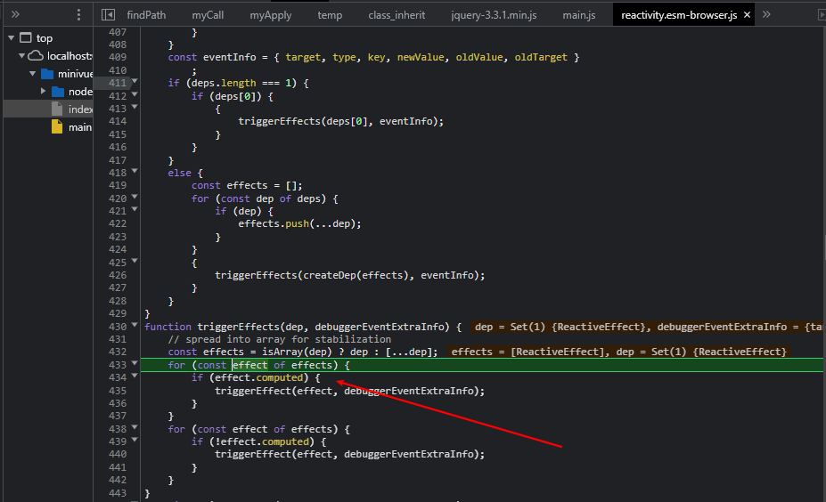

## 0-1-1 实现reactivity的ref的逻辑
1. 跑在浏览器上需要写明目录，而不是直接 `{@vue/reactivity}`
   1. 主要原因应该还是默认的打包格式不是esm
2. 引入reactivity.esm-browser文件时，不写后缀会导致报找不到文件的错误。
   1. 因为浏览器在解析import语句时，需要指定文件后缀；
   2. 而打包工具可以不用写是因为打包工具的兼容
3. 保存到devDependency是 --save-dev
4. 在effect包裹的fn里面访问，会触发依赖收集的过程
5. 有计算属性依赖的，还要通知下计算属性？

## 0-1-2 
1. Map的key可以是一个对象
